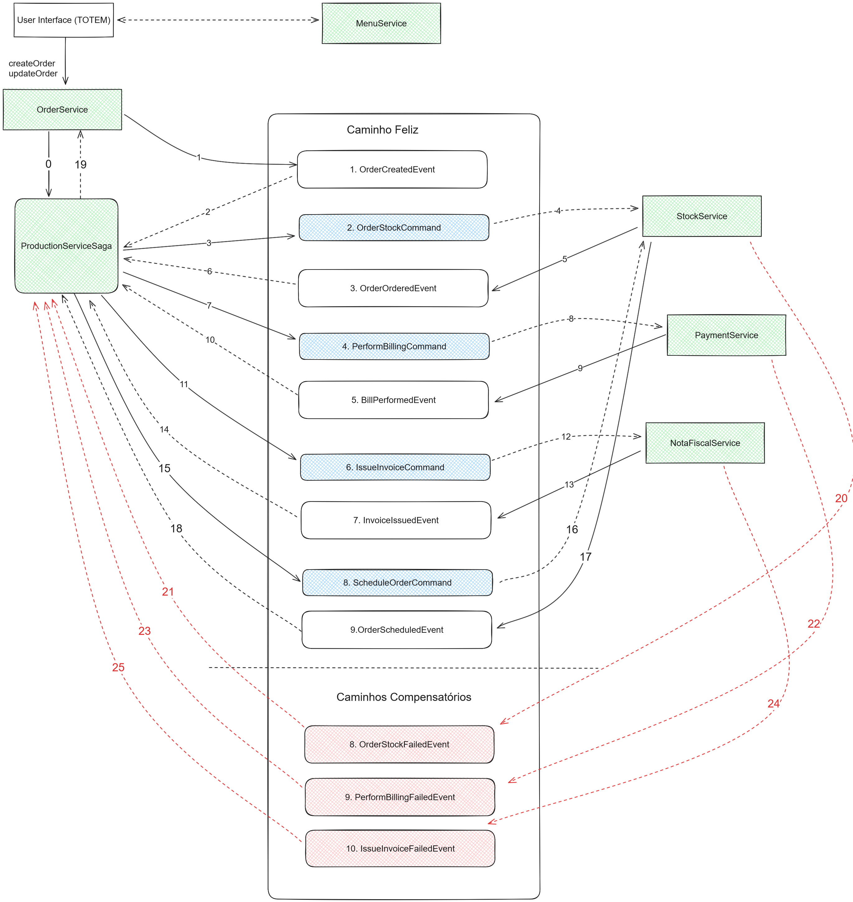

# Ordering System Production

Responsável por performar a produção

---

<h2>Para utilizar</h2>

Instalação
- Instalar o make conforme tutorial
- Rodar localmente o comando `make`

Desinstalação
- Rodar localmente o comando `make down`

Covarage

-----

<h2>SAGA Orquestrada (Caminho Feliz)</h2>

---
	
<h2>Referências</h2>

- [github aws-doc-sdk-examples](https://github.com/awsdocs/aws-doc-sdk-examples/tree/main/java)
- [ibm-cloud-architecture-saga-orchestration](https://ibm-cloud-architecture.github.io/eda-saga-orchestration/#happy-path)